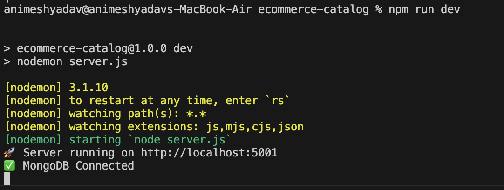

# E-commerce Catalog API

A simple Node.js + Express + MongoDB project to manage products with nested variants (color, size, stock).  

---

## Setup

1. Clone repo:
git clone https://github.com/your-username/ecommerce-catalog.git
cd ecommerce-catalog

2. Install dependencies:
npm install

3. Start MongoDB (Homebrew):
brew services start mongodb/brew/mongodb-community

4. Run server:
npm run dev

Server runs at http://localhost:5001

---

## API Endpoints

- POST /api/products/seed → Seed sample products  
- GET /api/products/filter?category=Clothing → Filter by category  
- GET /api/products/variants/:color → Get variants by color  

---

## Notes

- Use Postman to test APIs.  
- Make sure MongoDB is running before testing.  

---

## Screenshots
 |
 |
 |
 |
 |

